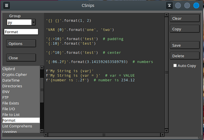
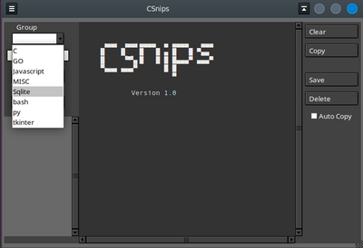

# CodeSnips
### Desktop Database to organize and store code snippets

 

CodeSnips is actually a simple database manager for organizing code snipits
where the table is keyed by topics and items. For instance, "Python" (topic), 
and "Formating" (item).

I comes with several topics with some items, but is really intended for you 
to go in and supply your own snipits (Topics, Items).

The `csnips.ini` file allows for some customization:  
<code>
\# font=DejaVu Sans Mono  
\# font=Liberation Mono  
\# font=Nimbus Mono  
font=Andale Mono  
\# font=Ubuntu Mono  
\# font=Tlwg Mono  
fontsize=10  
fg=snow2  
bg=#333  
cursorcolor=#fff  
literals=light goldenrod  
numbers=LightBlue1  
remarks=lightgreen  
tabsize=2  
autocopy=off  
</code>

Starting CSnips:

>`$ python3 /path.../csnips.py`

Note: csnips.py and all of its support
files must be installed into the same
directory.  
See the imports in csnips.py
for any other modules you may need to 
install.

The CSnips GUI interface will 'remember' 
its width/height and screen position from
each use. 

Organization in the csnips.db database
is by "Group" and snippet name.
To start a new "Group" type in the name
of the group in the "Group" ComboBox.

To add a snippet type in the snippet name
into the Entry box below the "Group" 
ComboBox. Enter your snippet text into
the text area and click "Save."

To access a snippet first select the "Group"
from the "Group" ComboBox. Then Click
the snippet name in the list. If "Auto Copy"
is checked the snippet contents are copyied
into the system clipboard whenever a snippet
is Clicked from the snippet list.

To delete a snippet use the "Delete"
button.

To delete an entire "Group" first click
the "Group" name in the ComboBox. Then
type the "Group" name into the snippet
Entry box as well. Then click "Delete."

To view and change options click the
"Options" button. To save "Options"
click the "Save" button. Do not
ADD or DELETE the options.

To quit the app click "Close."

Other hotkeys:  
__Ctrl-a__				Select All  
__Ctrl-s__				Save  
__Ctrl-q__				quit the application  

Selecting the text of a hyperlink and 
then Right-Clicking it will open it
in your default web browser.

Obviously don't forget to backup
the csnips.db Sqlite3 database file.

:)
